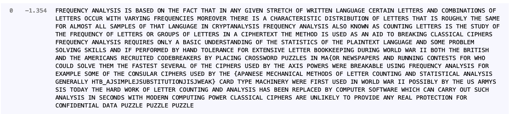

# Perfect Synchronization

************Category************: Crypto

****************Points:**************** 600

************************Difficulty:************************ very easy

## Description

The final stage of your initialization sequence is mastering cutting-edge technology tools that can be life-changing. One of these tools is quipqiup, an automated tool for frequency analysis and breaking substitution ciphers. This is the ultimate challenge, simulating the use of AES encryption to protect a message. Can you break it?

## Walkthrough

Unfortunately for me, I need to learn to read descriptions! This was actually quite simply in the end.  The class cipher reuses the same key, and salt and is using AES-ECB. Key and nonce reuse are insecure in ECB, because if you encrypt the same message twice, then the ciphertexts will be equal. 

### Code Analysis

```python
class Cipher:

    def __init__(self):
        self.salt = urandom(15)
        key = urandom(16)
        self.cipher = AES.new(key, AES.MODE_ECB)

    def encrypt(self, message):
        return [self.cipher.encrypt(c.encode() + self.salt) for c in message]
```

The main function shows exactly how this vulnerability is executed:

```python
def main():
    cipher = Cipher()
    encrypted = cipher.encrypt(MESSAGE)
    encrypted = "\n".join([c.hex() for c in encrypted])

    with open("output.txt", 'w+') as f:
        f.write(encrypted)
```

Each character of the message is encrypted separately. For example, let’s say we have message ‘Hello’. The ciphertext for l will be the same each time. This is where the hint for frequency analysis comes in. We aren’t meant to break the cipher, but rather identify the frequency of each characters. Honestly, I took way longer to solve this than I should have. The longer version will be posted on my blog.

Most importantly, we get a hint about the ciphertext in the fifth line of the script:

```python
assert all([x.isupper() or x in '{_} ' for x in MESSAGE])
```

So the pattern of string we are looking for is all capital ascii letters + ‘{_} ‘, which will help to replace the values. With frequency analysis, we need to generate a dictionary from the most used ascii letters. Therefore, we first need to get a list of most frequently used letters. I used the one from Wikipedia and used pandas/requests/beautiful soup to parse it, following this [tutorial](https://medium.com/analytics-vidhya/web-scraping-a-wikipedia-table-into-a-dataframe-c52617e1f451). 

## Solution

### Step 1: Generating a dictionary from Wikipedia:

```python
import pandas as pd
import requests
from bs4 import BeautifulSoup

wikiurl="https://en.wikipedia.org/wiki/Letter_frequency"
table_class="wikitable sortable jquery-tablesorter"

def get_dict(wikiurl,table_class):
	response=requests.get(wikiurl)
	soup = BeautifulSoup(response.text, 'html.parser')
	indiatable=soup.find('table',{'class':"wikitable"})
	df=pd.read_html(str(indiatable))
	df=pd.DataFrame(df[0])
	df.columns=df.columns.droplevel(0)
	df=df.reset_index(drop=True)
	df['Texts']=df['Texts'].apply(lambda x: float(x.replace('%','')))
	out_dict = list(df.sort_values('Texts',ascending=False)['Letter'])
	return out_dict

dict_map = get_dict(wikiurl,table_class)
```

### Step 2: Frequency Analysis

So now that we have our dictionary, we can start parsing the values by frequency. The Wikipedia dictionary didn’t include the strings ‘{_} ‘. So we will need to add them ourselves. Realistically, the space string (’ ‘) is probably the most used, so we can place it at the beginning of the list.

```python
from collections import Counter

with open('files/output.txt','r') as inf:
	data = inf.readlines()

def parse_data(data, dict_map):
	data = [i.strip() for i in data]
	unique_vals = list(set(data))
	#len(unique_vals) == 30
	plain_vals = [' '] + dict_map + [i for i in '{_}']
	assert len(plain_vals) == len(unique_vals)
	counts = Counter(data)
	dict_items = {k: v for k, v in sorted(dict(counts).items(), key=lambda item: item[1],reverse=True)}
	dict_items.update(zip(dict_items, plain_vals))
	new_data =[]
	for val in data:
		c = dict_items[val]
		new_data.append(c)
	return ''.join(new_data)

cipher = parse_data(data,dict_map)

with open('files/cipher.txt','w') as outf:
	outf.write(cipher)
```

Now, all we need to do is paste the cipher  into [quipqiup](https://quipqiup.com/). It returns this, which we can see has the HTB flag, but it’s not exactly perfect:



The string we get is ‘HTB_AJSIMPLEJSUBSTITUTIONJISJWEAK}’, it’s not too complicated to see that J is meant to be ‘_’, and ‘_’ is meant to be ‘{’, giving us: HTB{A_SIMPLE_SUBSTITUTION_IS_WEAK}.

************Flag:************ HTB{A_SIMPLE_SUBSTITUTION_IS_WEAK}